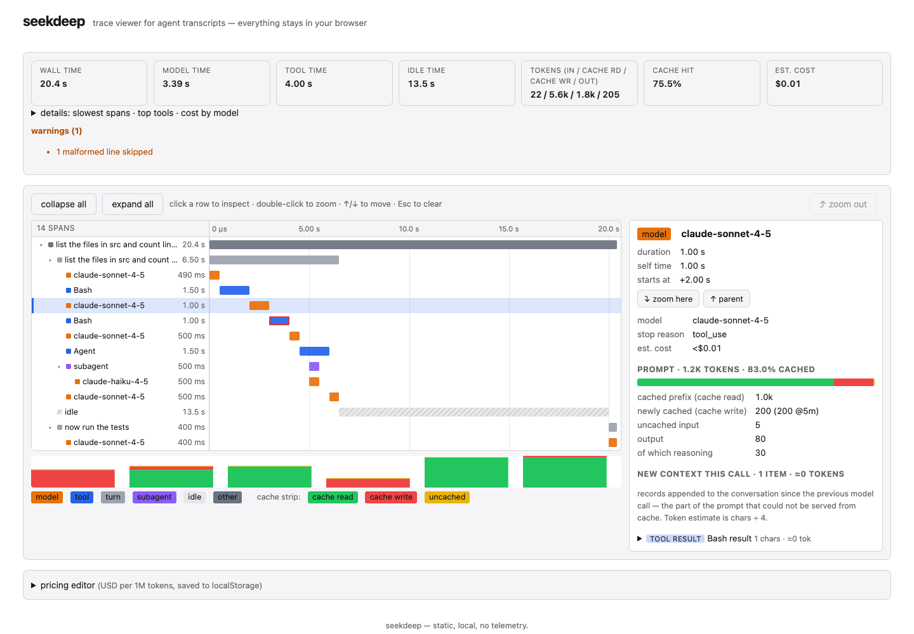

# seekdeep

Trace viewer for coding-agent sessions.

`seekdeep` reads the transcripts that agent tools already write to disk —
**Claude Code**, **drip**, **Codex**, **OpenCode**, **pi** — and turns a session into a trace
you can dig into: where the wall-clock went, what each model call cost, how
the prompt cache behaved turn by turn, and which tools dominated.

It is a static site. Nothing leaves your machine: open the published page,
drop a `.jsonl` file (or a whole session directory) onto it, and the parse and
render happen entirely in your browser.



## What you get

- **Trace waterfall** (OpenTelemetry / Jaeger style): one row per span —
  prompts → turns → model calls and tool calls, subagents nested underneath —
  indented by depth on a shared time axis, so you can see what ran when,
  what waited on what, and where the wall-clock went. Collapse subtrees,
  double-click to zoom into a span, ↑/↓ to walk the rows.
- **Detail pane**: click any span. Tool calls show their full input and
  output. Model calls show the prompt split into *cached prefix / newly
  cached / uncached* tokens, the **new context** appended since the previous
  call (the prompts and tool results that could not come from cache), the
  model's output, and thinking when the transcript has it.
- **Cache trace**: one bar per model call in order — cache read vs. cache
  write vs. uncached input — so the exact call where the prefix went cold
  is obvious.
- **Cost breakdown**: estimated spend per turn, per tool, per model, computed
  from a pricing table you can edit in the UI.
- **Session summary**: total wall time, model time vs. tool time vs. idle,
  token totals, hit rate, cost, slowest spans, most-called tools.

## Supported formats

| Tool        | Where the files live                                          | What we read                                                                                |
| ----------- | ------------------------------------------------------------- | ------------------------------------------------------------------------------------------- |
| Claude Code | `~/.claude/projects/<slug>/<session-id>.jsonl`                | `assistant` / `user` records, `message.usage` (cache read/create, ephemeral 5m/1h), `tool_use` / `tool_result`, `parentUuid`, `isSidechain`, `timestamp` |
| drip        | `~/.drip/projects/<slug>/sessions/<id>/transcript.jsonl` (lci, its TypeScript predecessor, wrote the same files under `~/.lci`) | `event` records: `inference` (prompt/cache/completion tokens, `latencyMs`, model, provider), `tool-call` / `tool-result` (`durationMs`, `failed`), `iteration-start`, `loop-start`, `run-summary` |
| Codex       | `~/.codex/sessions/YYYY/MM/DD/rollout-*.jsonl`                | `session_meta`, `turn_context`, `event_msg` (`task_started`, `task_complete`, `token_count`), `response_item` (`message`, `function_call`, `function_call_output`) |
| OpenCode    | `~/.local/share/opencode/opencode.db` (SQLite + WAL), or an `opencode export` JSON file | `session` / `message` / `part` rows: `step-finish` tokens (input, output, reasoning, cache read/write) per API call, `tool` parts (`state.time`, `status`), `text` / `reasoning` parts |
| pi          | `~/.pi/agent/sessions/<cwd-dir>/<timestamp>_<id>.jsonl`       | `session` header (cwd), `message` entries: assistant `usage` (input, output, cacheRead/Write, reasoning), `toolCall` blocks paired with `toolResult` messages, `model_change` |

Format is auto-detected from the first few records. Unknown files fall back
to a generic parser that looks for `timestamp` + `usage`-shaped objects.

The session picker connects each harness's home directory (`~/.claude`,
`~/.codex`, `~/.drip`, `~/.local/share/opencode`, `~/.pi/agent`) and nests drip runs under
the Claude Code, Codex, OpenCode or pi session that launched them — matched by the
launching session's scratchpad (Claude Code) or by same working directory and
time window — and grafts them into that session's waterfall under the shell
call that ran `drip` (or `lci`, its predecessor). OpenCode's SQLite store is read in the browser with
[sql.js](https://github.com/sql-js/sql.js) (loaded only when that source is
connected); committed write-ahead-log frames are folded in first, so sessions
OpenCode has not checkpointed yet still show up.

## Using it

Hosted: **https://a1re1.github.io/seekdeep/** — open it, then drag a
transcript onto the page or use the file picker. Files are read with the
browser File API and never uploaded.

Locally:

```sh
bun install
bun run dev        # serve with live reload
bun run build      # emit static site into dist/
bun run test
```

## Design notes

- **Bun-only toolchain.** `bun build` bundles the TypeScript app; there is no
  webpack/vite layer. The output in `dist/` is plain HTML/JS/CSS and is what
  GitHub Pages serves.
- **Parsers are pure.** Each format has a parser in `src/parsers/` that maps
  raw JSONL records to a common `Span` tree (`src/model.ts`). The renderer
  never sees format-specific fields, so adding a new agent tool is one file.
- **Costs are estimates.** Pricing comes from `src/pricing.ts` (per-model
  input / output / cache-read / cache-write rates). Edit it in the UI if your
  rates differ; the table is stored in `localStorage`. A row may also carry a
  `longContext` tier that reprices a whole request once its prompt passes a
  threshold (GPT-6 Astra: 2x input, 1.5x output past 272K); tiers are not
  editable in the UI. On the activity page, where usage is already summed into
  hourly buckets, the threshold is applied to a bucket's mean prompt size — an
  hour mixing one long request with many short ones reads low.
- **Large files.** Transcripts run to hundreds of MB. Parsing streams line by
  line and skips content bodies it doesn't need (thinking text, tool output),
  keeping only what the graph displays.

## Status

Early. The parsers track the transcript shapes emitted by the tool versions
we run day to day; when a tool changes its schema, open an issue with a
(redacted) sample record.

- Claude Code: verified against real multi-turn sessions (subagents, split
  assistant records, 1h cache writes).
- drip: the Rust port of lci with the same session format, so `~/.lci`
  directories connect as the drip source too. `inference` events only exist
  in recent builds; older transcripts
  still produce loop/tool spans with a "no inference events" warning.
- Codex: the session index scans `~/.codex/sessions` rollout transcripts
  (session id, cwd, title and timestamps from `session_meta` and the first
  user prompt); `token_count` / `function_call` handling follows Codex's
  rollout schema but has been exercised mainly on synthetic fixtures so far.
- OpenCode: read from the 1.x SQLite schema (`session`, `message`, `part`
  tables); the pre-1.0 JSON storage layout is not scanned. Child sessions
  (sub-agents) fold into their root session's trace.
- pi: verified against a real pi 0.73 session; branch summaries and
  compactions become model spans when they carry usage.

## License

MIT
